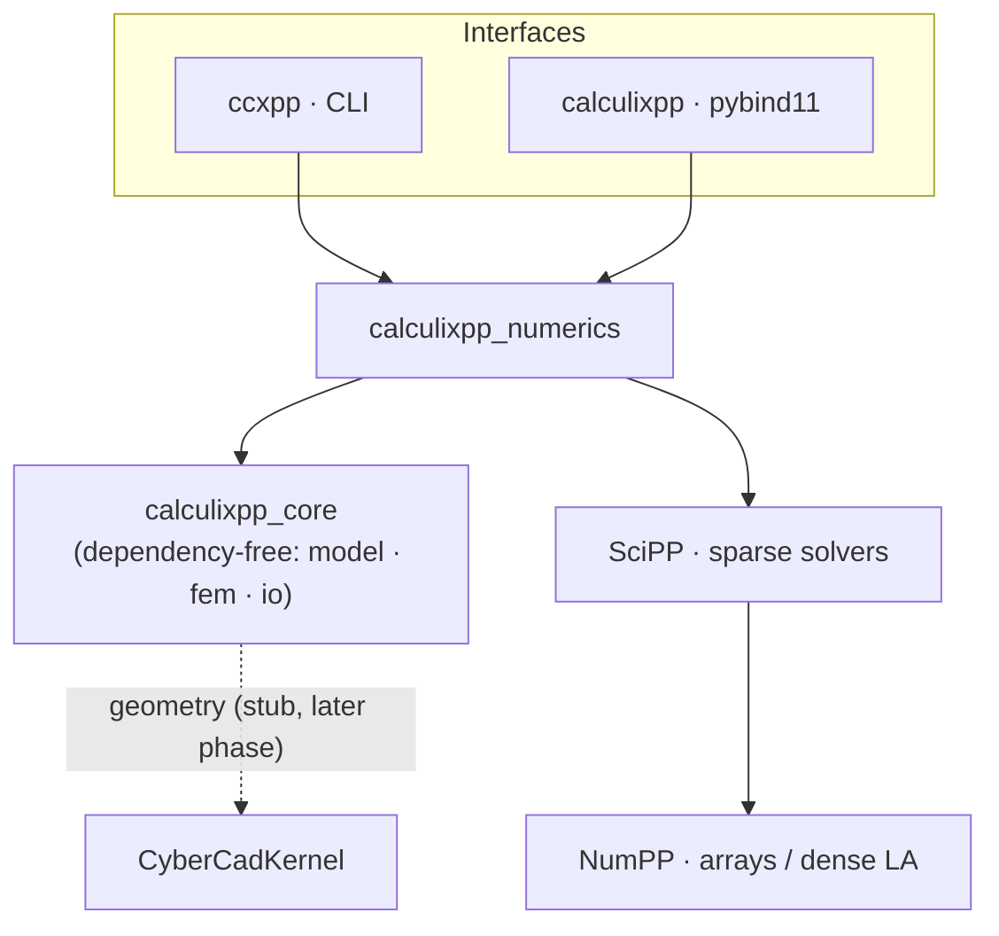
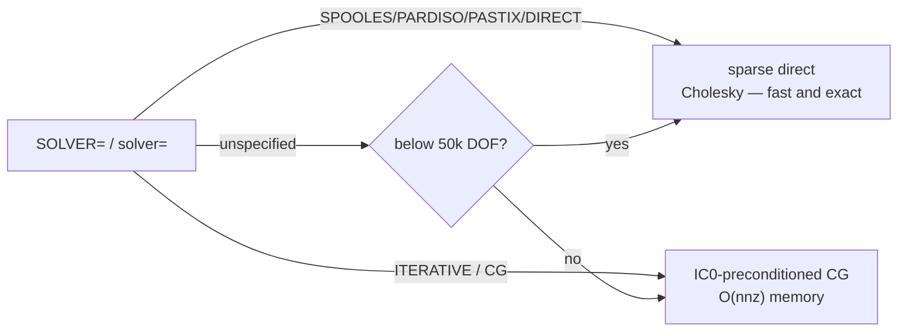
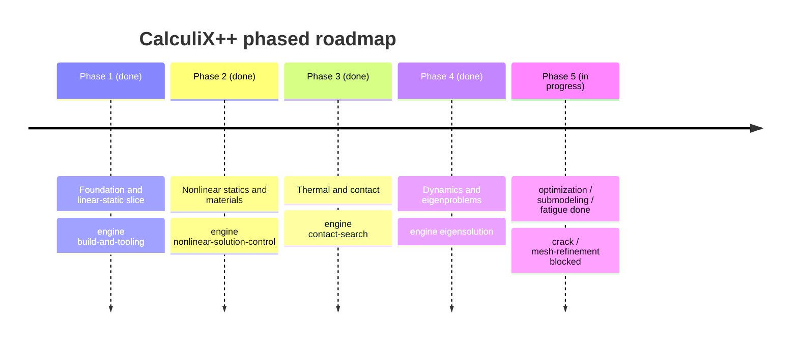

# CalculiX++ &nbsp;·&nbsp; `CalculixPP`

**A ground-up port of the [CalculiX](https://github.com/Dhondtguido/CalculiX) 3-D structural finite element solver to modern, portable C++20** — built to run on mobile (iOS/Android) and desktop, with optional GPU acceleration and first-class Python bindings.

  -3B5526) 

Numerics come from in-house libraries — **[NumPP](https://github.com/CyberdyneCorp/NumPP)** (NumPy-equivalent arrays + dense linear algebra) and **[SciPP](https://github.com/CyberdyneCorp/SciPP)** (SciPy-equivalent; sparse matrices and solvers) — with **[CyberCadKernel](https://github.com/CyberdyneCorp/CyberCadKernel)** for CAD/meshing. The whole design is spec-driven: the specification and phased roadmap live in [`openspec/`](openspec/).

> **Phases 1–4 are complete and validated; Phase 5's non-blocked capabilities have landed.** The solver covers linear + nonlinear statics, thermal & contact, dynamics/eigenproblems, and the structural-completion set (design optimization, submodeling, high-cycle fatigue) — each validated against stock CalculiX or an analytic reference. Only two CyberCadKernel-gated Phase-5 items remain (crack propagation, adaptive mesh refinement). Per-phase detail below.
>
> **Phase 1 (Foundation) — COMPLETE and validated.** The linear-static pipeline solves the reference `beam10p.inp` cantilever and its nodal displacements match **stock CalculiX to a relative L2 of 5.4 × 10⁻⁸**. A larger 8,268-DOF model solves in **0.34 s** (sparse Cholesky).
>
> **Phase 2 (Nonlinear statics & materials) — COMPLETE and validated.** A Newton-Raphson driver (`solve_nonlinear`) with automatic incrementation now drives J2 plasticity, a C++ user-material seam, and the full hex/wedge element family (`C3D8`/`C3D20`/`C3D6`/`C3D15` + reduced `C3D8R`/`C3D20R`), plus amplitudes, body loads (`GRAV`/`CENTRIF`), springs/masses, and constraints (`*EQUATION`/`*MPC`/`*RIGID BODY`/`*COUPLING`/`*TIE`). New reference decks validate: `beam8p` (C3D8) and `beam20p` (C3D20) match stock CalculiX to **rel-L2 ~5.7 × 10⁻⁸**, and the nonlinear driver reproduces the linear solve to **< 10⁻¹⁰** in one increment.
>
> **Phase 3 (Thermal & contact) — COMPLETE and validated.** A scalar 1-DOF/node temperature field runs in parallel to the mechanical path, reusing the same mesh, shape functions/Gauss rules, and sparse solve: steady-state and transient (backward-Euler) conduction, `*CFLUX`/`*DFLUX` heat loads, convective `*FILM`, linearized surface and gray-body cavity `*RADIATE`, monolithic + staggered `*COUPLED TEMPERATURE-DISPLACEMENT` thermal stress (`*EXPANSION`), and element/contact-pair `*MODEL CHANGE` on a multi-step engine. **Contact** is a nonlinear constraint contributing to the Newton tangent/residual: node-to-surface **penalty** contact with a spatial contact-search engine (uniform-grid broad phase + closest-point projection), `*SURFACE BEHAVIOR` (hard/linear/exponential), Coulomb `*FRICTION` (stick↔slip), thermal contact (`*GAP CONDUCTANCE` / `*GAP HEAT GENERATION`), `*CLEARANCE`, and CSTR contact output (status/pressure/gap/traction). `solve()` auto-dispatches `*HEAT TRANSFER` (returning `NT`/`RFL`) and `*CONTACT PAIR` (returning the mechanical fields plus a per-node `contact` list). Validated against stock CalculiX heat decks (`oneel20cf`/`df`/`fi` steady conduction to ~1e-9, `oneel20fi2` transient film relaxation to ~1e-4) and the `beamt` thermal-stress deck (rel-L2 ~2.4 × 10⁻⁶); contact and thermal contact against analytical two-block references (global equilibrium, penalty penetration `F/(4κ)`, series-resistance gap flux — the stock contact decks use NLGEOM + CalculiX's exact exponential law + MPCs and are not gated). **Surface-to-surface mortar contact is deferred** — a `TYPE=SURFACE TO SURFACE` pair is rejected with an actionable error rather than silently mis-solved.
>
> **Phase 4 (Dynamics & eigenproblems) — COMPLETE and validated.** A mechanical **mass matrix** `M_e = ∫ρ NᵀN dV` (consistent + lumped, the mechanical analog of the thermal capacitance) and an **eigensolution engine** for the generalized symmetric problem `K φ = λ M φ` (**SciPP sparse thick-restart shift-invert Lanczos** `eigsh`, scalable to large FE meshes, with a dense NumPP `eigh` fallback for small / rigid-body pencils; mass-normalized ascending basis, participation factors / effective mass) underpin the frequency-domain and transient procedures: `*FREQUENCY` (natural frequencies + mode shapes), `*MODAL DYNAMIC` (modal superposition, exact Nigam-Jennings recurrence), `*STEADY STATE DYNAMICS` (harmonic sweep), `*DYNAMIC` (implicit HHT-α direct integration, linear + nonlinear), Rayleigh / modal `*DAMPING`, `*COMPLEX FREQUENCY` (damped complex modes by proportional-damping reduction onto the `*FREQUENCY` basis), `*SUBSTRUCTURE GENERATE` Craig-Bampton / Guyan reduction, and `*BUCKLE` (linear buckling — geometric stiffness `K_geo` + two-step prestress → `(K + λ K_geo) φ = 0`, solved by SciPP's sparse `eigsh_buckling` with a dense fallback, scalable to ~18k DOF). Validated against stock CalculiX `beam8f` (`*FREQUENCY` — 10 eigenvalues/frequencies/participation to **< 1e-4 rel**), `beamb` (`*BUCKLE` C3D20R Euler column — all 10 load factors to **6 digits**, λ₁ = 48.15), and `substructure` (Guyan, 60 retained DOFs, **< 1e-6 rel**), plus analytical references (SDOF step response, α=0 energy conservation, resonant peak/bandwidth, and the exact damped-SDOF closed form `λ = -ζω ± iω√(1-ζ²)`). Remaining deferred: the gyroscopic **`*COMPLEX FREQUENCY, CORIOLIS` / `FLUTTER`** paths (a different eigenproblem needing a rotor-speed body load / complex applied force — rejected at parse time), **cyclic symmetry**, finite-strain **NLGEOM** / `*STATIC, PERTURBATION`, explicit `*DYNAMIC, EXPLICIT`, and `*GREEN`; each blocked card fails with an actionable parse error naming its enabler.
>
> **Phase 5 (Structural completion) — unblocked capabilities COMPLETE and validated.** Three design/assessment procedures build on the Phase 1–4 spine: **submodeling** (`*SUBMODEL` / `*BOUNDARY, SUBMODEL` — drives a refined local model by interpolating the stored global displacement field onto its boundary; global-vs-submodel field to **rel-L2 8.1 × 10⁻⁵**), **high-cycle fatigue** (`*HCF` / `*FATIGUE` — inverts a Basquin S-N curve over a recovered stress field for the worst-case location and cycles-to-failure; exact analytic match), and **design optimization** (`*SENSITIVITY` / `*DESIGN VARIABLES` / `*DESIGN RESPONSE` — adjoint coordinate-shape gradients `dObjective/dx` reusing the primal factorization; adjoint-vs-finite-difference agreement to **~10⁻⁶**). The two remaining Phase-5 items — **crack propagation** and **adaptive mesh refinement** — are deferred pending CyberCadKernel remeshing (each blocked card fails with an actionable parse error). With CFD/EM/networks out of scope, the solver is feature-complete for its structural / mechanical / civil domain.

---

## Pipeline


## Features

The table below traces the linear (Phase 1) → nonlinear (Phase 2) element/material/load/solver breadth. **Phases 3–4 add thermal & contact and dynamics/eigenproblems** on top — see the status summary above, the [Python examples](#python--heat-transfer-phase-3) below, and the [roadmap](#roadmap).

| Area | Phase 1 | Phase 2 |
|---|---|---|
| **Elements** | Linear `C3D4` and quadratic `C3D10` tetrahedra, isotropic linear elasticity | Hex/wedge families `C3D8` / `C3D20` / `C3D6` / `C3D15` (full) + reduced `C3D8R` (hourglass control) / `C3D20R`; discrete `*SPRING` / `*MASS` / `*DASHPOT` |
| **Materials** | Isotropic linear elasticity (`*ELASTIC`) | Rate-independent J2 plasticity (`*PLASTIC`, isotropic/kinematic/combined + `*CYCLIC HARDENING`) with consistent tangent; neo-Hookean `*HYPERELASTIC`; C++ `*USER MATERIAL` (`*DEPVAR`/`*RATEDEPENDENT`) |
| **Solve** | Linear `K u = f` (sparse direct / IC0-CG) | Newton-Raphson `solve_nonlinear` with automatic incrementation, cutback, `DIRECT`, `*CONTROLS`, and optional line search |
| **Loads** | `*CLOAD`, `*DLOAD` (pressure) | `*AMPLITUDE` (step/tabular/periodic), body loads `GRAV` / `CENTRIF`, `*DSLOAD`, `OP=MOD`/`OP=NEW` |
| **Constraints** | Single-point `*BOUNDARY` | `*EQUATION`, `*MPC` (BEAM/PLANE/STRAIGHT), `*RIGID BODY`, `*COUPLING` (kinematic/distributing), matching `*TIE`; over-constraint detection |
| **Input** | Abaqus-style `.inp`: `*NODE`, `*ELEMENT`, `*NSET`/`*ELSET`, `*SURFACE`, `*MATERIAL`/`*ELASTIC`/`*DENSITY`, `*SOLID SECTION`, `*BOUNDARY`, `*CLOAD`, `*DLOAD` (pressure), `*STEP`/`*STATIC` (`SOLVER=`) | Full Phase-2 card set above; deferred cards (`*HYPERFOAM`, `*CREEP`, `*VISCO`, `*MOHR COULOMB`, `*SHELL`/`*BEAM SECTION`, ...) raise a clear, actionable error rather than a silent wrong solve |
| **Results** | Nodal displacement, stress, strain, reaction forces; **CGX-compatible `.frd`** (DISP/STRESS/STRAIN/FORC) + tabular `.dat` | Nonlinear result payload: `converged`, `newton_increments` / `newton_iterations` / `newton_cutbacks`; solve-free `summary()` introspection of the Phase-2 capabilities |
| **Interfaces** | `ccxpp` command-line runner and a **`calculixpp` Python module** (NumPy arrays) | `solve_nonlinear` / `solve_nonlinear_text` bindings; `solve()` auto-routes plastic/nonlinear decks to the Newton driver |
| **Compute** | Pluggable `ComputeBackend` (CPU reference today); **builds & runs with no GPU toolkit** — GPU backends are additive | (unchanged — CPU reference backend) |
| **Portability** | Pure C++20, mobile-first; iOS/Android cross-compile toolchain files | (unchanged) |
| **Quality** | Validated against stock CalculiX references; CI runs build + tests + `openspec validate` | New reference decks `beam8p` / `beam20p` and `achtel*` (`*EQUATION` / body loads) validated; plasticity/user-material against analytic solutions |

## Architecture



`calculixpp_core` has **no external dependencies** — the domain model, element kernels, and assembly build and test everywhere (including mobile toolchains). Only the thin numerics layer links SciPP/NumPP.

## Build

```bash
# Core + solver + CLI + Python module
cmake -S . -B build -G Ninja \
  -DCALCULIXPP_WITH_SOLVER=ON -DCALCULIXPP_BUILD_PYTHON=ON
cmake --build build
ctest --test-dir build --output-on-failure
```

Requires a C++20 compiler and CMake ≥ 3.24. The numerics layer needs **NumPP** and **SciPP** (≥ v1.5.0, for the sparse `eigsh` / `eigsh_buckling` eigensolvers); `scripts/bootstrap_deps.sh` builds/installs NumPP and points the build at a SciPP checkout. Python bindings additionally need `pip install pybind11 pytest numpy`. **No GPU toolkit is required.**

## Quick start

> **Runnable end-to-end examples** live in [`examples/`](examples/): a steel table under a central load and a tapered cell-tower **antenna mast** under self-weight + a 200 km/h side wind — each turns a CAD/art asset (OBJ/FBX) into a solid FE mesh, solves, and renders the von Mises field (matplotlib + ParaView `.vtk`). See [`examples/README.md`](examples/README.md).

### Command line

```bash
build/apps/ccxpp beam10p.inp -o beam10p          # writes beam10p.frd, beam10p.dat
# CalculiX++  beam10p.inp
#   nodes=90  elements=31
#   max |u|        = 0.0881733
#   max von Mises  = 404.262

build/apps/ccxpp beam10p.inp --solver cg          # force IC0-CG (default is size-based)
```

### Python

```python
import calculixpp
import numpy as np

r = calculixpp.solve("beam10p.inp")               # solver="" -> auto; or "direct" / "cg"
U = r["displacement"]                             # (N, 3) NumPy array
S = r["stress"]                                   # (N, 6): xx,yy,zz,xy,xz,yz

print("nodes:", r["num_nodes"], "elements:", r["num_elements"])
print("max |u| =", np.linalg.norm(U, axis=1).max())

# von Mises from the stress tensor
sxx, syy, szz, sxy, sxz, syz = (S[:, i] for i in range(6))
vm = np.sqrt(0.5 * ((sxx - syy) ** 2 + (syy - szz) ** 2 + (szz - sxx) ** 2)
             + 3 * (sxy ** 2 + sxz ** 2 + syz ** 2))
print("max von Mises =", vm.max())

# Inspect a deck without solving, and query compute backends
calculixpp.summary("beam10p.inp")                 # {num_nodes, num_elements, materials, ...}
calculixpp.available_backends()                   # ['cpu']  (GPU backends land later)
```

### Python — nonlinear (Phase 2)

A deck with `*PLASTIC` (or any nonlinear material) is auto-routed through the Newton-Raphson driver by `solve()`; you can also call `solve_nonlinear` explicitly to pass driver options and read back the increment/iteration report. This example takes a single `C3D8` hex past yield and recovers the analytic uniaxial hardening curve `sigma = sy0 + H * eps_p`:

```python
import calculixpp

plastic_cube = """
*NODE
1, 0., 0., 0.
2, 1., 0., 0.
3, 1., 1., 0.
4, 0., 1., 0.
5, 0., 0., 1.
6, 1., 0., 1.
7, 1., 1., 1.
8, 0., 1., 1.
*ELEMENT, TYPE=C3D8, ELSET=EALL
1, 1, 2, 3, 4, 5, 6, 7, 8
*BOUNDARY
1, 1, 1
4, 1, 1
5, 1, 1
8, 1, 1
1, 2, 2
2, 2, 2
5, 2, 2
6, 2, 2
1, 3, 3
2, 3, 3
3, 3, 3
4, 3, 3
*MATERIAL, NAME=STEEL
*ELASTIC
210000., 0.3
*PLASTIC
800., 0.0
960., 0.02
*SOLID SECTION, ELSET=EALL, MATERIAL=STEEL
*STEP
*STATIC
0.25, 1.0
*CLOAD
5, 3, 225.
6, 3, 225.
7, 3, 225.
8, 3, 225.
*END STEP
"""

# Explicit Newton driver (optional line_search=True for hard increments).
r = calculixpp.solve_nonlinear_text(plastic_cube)
print("converged:", r["converged"], "increments:", r["newton_increments"])

S = r["stress"]                                    # (N, 6): xx,yy,zz,xy,xz,yz
szz = sum(float(S[k][2]) for k in range(len(S))) / len(S)
print("axial stress =", szz)                       # -> 900.0  (sy0=800 + 8000 * 0.0125)

# solve() auto-dispatches the same plastic deck to the nonlinear driver.
same = calculixpp.solve_text(plastic_cube)
assert same["converged"] is True

# summary() introspects Phase-2 capabilities without solving.
s = calculixpp.summary_text(plastic_cube)
print(s["element_type_counts"], "plastic:", s["has_plasticity"])
```

### Python — heat transfer (Phase 3)

A `*HEAT TRANSFER` deck is auto-dispatched by `solve()` to the scalar thermal solver, which returns the nodal temperature field (`NT`) and the heat-flux reaction (`RFL`) instead of displacement/stress. This unit cube conducts between a hot face (x=1, held at 100) and a cold face (x=0, held at 0); the analytic steady field is a linear profile, recovered exactly:

```python
import calculixpp

heat_cube = """
*NODE
1, 0., 0., 0.
2, 1., 0., 0.
3, 1., 1., 0.
4, 0., 1., 0.
5, 0., 0., 1.
6, 1., 0., 1.
7, 1., 1., 1.
8, 0., 1., 1.
*ELEMENT, TYPE=C3D8, ELSET=EALL
1, 1, 2, 3, 4, 5, 6, 7, 8
*MATERIAL, NAME=COND
*CONDUCTIVITY
50.
*SOLID SECTION, ELSET=EALL, MATERIAL=COND
*STEP
*HEAT TRANSFER, STEADY STATE
*BOUNDARY
1, 11, 11, 0.
4, 11, 11, 0.
5, 11, 11, 0.
8, 11, 11, 0.
2, 11, 11, 100.
3, 11, 11, 100.
6, 11, 11, 100.
7, 11, 11, 100.
*END STEP
"""

r = calculixpp.solve_text(heat_cube)
print(r["procedure"])                              # -> "heat transfer steady state"
T = r["temperature"]                               # (N,) nodal temperature (NT)
Q = r["flux_reaction"]                             # (N,) heat-flux reaction (RFL)
print("T range:", float(min(T)), "->", float(max(T)))   # 0.0 -> 100.0 (linear profile)

# summary() reports the analysis procedure without solving.
print(calculixpp.summary_text(heat_cube)["procedure"])  # "heat transfer steady state"
```

Transient conduction (drop `STEADY STATE`, add `*SPECIFIC HEAT` / `*DENSITY` and an `*INITIAL CONDITIONS, TYPE=TEMPERATURE`) marches backward-Euler over the step period; `*COUPLED TEMPERATURE-DISPLACEMENT` returns both the temperature and the thermal-stress mechanical fields in one result dict.

### Python — contact (Phase 3)

A deck with a `*CONTACT PAIR` is a nonlinear constraint: `solve()` auto-dispatches it to the Newton driver, where node-to-surface **penalty** contact contributes to the tangent and residual each iteration. Two stacked cubes meeting only through a `*CONTACT PAIR` transmit a load across the interface — the base reaction balances the applied force (global equilibrium) with a small penalty penetration. The result dict carries the usual mechanical fields **plus** a `contact` list of per-slave-node CSTR records (status, normal pressure, signed gap, tangential traction):

```python
import calculixpp

two_block = """
*NODE, NSET=NALL
1, 0., 0., 0.
2, 1., 0., 0.
3, 1., 1., 0.
4, 0., 1., 0.
5, 0., 0., 1.
6, 1., 0., 1.
7, 1., 1., 1.
8, 0., 1., 1.
9, 0., 0., 1.
10, 1., 0., 1.
11, 1., 1., 1.
12, 0., 1., 1.
13, 0., 0., 2.
14, 1., 0., 2.
15, 1., 1., 2.
16, 0., 1., 2.
*ELEMENT, TYPE=C3D8, ELSET=EBASE
1, 1,2,3,4,5,6,7,8
*ELEMENT, TYPE=C3D8, ELSET=ETOP
2, 9,10,11,12,13,14,15,16
*ELSET, ELSET=EALL
EBASE, ETOP
*NSET, NSET=NBOT
1,2,3,4
*MATERIAL, NAME=STEEL
*ELASTIC
210000., 0.3
*SOLID SECTION, ELSET=EALL, MATERIAL=STEEL
*BOUNDARY
NALL,1,2
NBOT,3,3
*SURFACE, NAME=SMAST
EBASE, S2
*SURFACE, NAME=SSLAV, TYPE=NODE
9,10,11,12
*SURFACE INTERACTION, NAME=SI
*SURFACE BEHAVIOR, PRESSURE-OVERCLOSURE=LINEAR
1.0e6
*CONTACT PAIR, INTERACTION=SI, TYPE=NODE TO SURFACE
SSLAV, SMAST
*STEP
*STATIC
*CLOAD
13,3,-25.
14,3,-25.
15,3,-25.
16,3,-25.
*END STEP
"""

r = calculixpp.solve_text(two_block)
print(r["converged"])                                      # -> True
rz = sum(r["reaction"][i][2] for i in range(4))            # base z-reaction ~ 100 (= F)
print("base reaction:", rz)                                # transmits the full load
for c in r["contact"]:                                     # CSTR per slave node
    print(c["node"], c["closed"], round(c["pressure"], 3), c["gap"])
    # 9 True 100.0 -2.5e-05  ... all CLOSED, p ~ 100, small penalty penetration
```

Add `*FRICTION` (Coulomb, stick↔slip) for tangential traction, `*GAP CONDUCTANCE` / `*GAP HEAT GENERATION` for thermal contact (heat crossing the interface, reachable from a `*HEAT TRANSFER` deck), and `*CLEARANCE` for an initial gap. `*MODEL CHANGE, TYPE=CONTACT PAIR` activates/deactivates a pair between steps. Surface-to-surface **mortar** contact is not implemented — a `TYPE=SURFACE TO SURFACE` pair is rejected with an actionable error rather than silently mis-solved.

### Python — frequency & substructure (Phase 4)

A `*FREQUENCY` deck extracts the lowest _N_ natural frequencies and mode shapes of the generalized eigenproblem `K φ = ω² M φ` (mechanical **mass matrix** `M_e = ∫ρ NᵀN dV` + SciPP's sparse thick-restart shift-invert Lanczos `eigsh`, with a dense NumPP fallback for small / rigid-body pencils); `solve()` returns `eigenvalue`/`omega`/`frequency`/`mode_shape` plus modal `participation`/`effective_mass`.

A `*SUBSTRUCTURE GENERATE` step condenses the model onto the **retained (master) DOFs** of `*RETAINED NODAL DOFS`, producing a superelement. Static **Guyan** reduction forms the reduced stiffness Schur complement `K̂ = K_bb − K_bi K_ii⁻¹ K_ib`; adding a mass request (`*SUBSTRUCTURE MATRIX OUTPUT, MASS=YES`) and fixed-interface modes (a `*FREQUENCY` card inside the step) switches to **Craig-Bampton** reduction (constraint modes + fixed-interface normal modes from the eigensolution engine). The reduced matrices export in the reference `*MATRIX TYPE=STIFFNESS/MASS` lower-triangular format; `solve()` returns `k_reduced` / `m_reduced` plus the retained-DOF labels and `modal_omega`:

```python
import calculixpp

# Craig-Bampton reduction of a cantilever column onto its top-face DOFs + 6 modes.
deck = """
*NODE
1,0.,0.,0.
2,1.,0.,0.
3,1.,1.,0.
4,0.,1.,0.
5,0.,0.,1.
6,1.,0.,1.
7,1.,1.,1.
8,0.,1.,1.
9,0.,0.,2.
10,1.,0.,2.
11,1.,1.,2.
12,0.,1.,2.
*ELEMENT,TYPE=C3D8,ELSET=EALL
1,1,2,3,4,5,6,7,8
2,5,6,7,8,9,10,11,12
*NSET,NSET=TOP
9,10,11,12
*MATERIAL,NAME=EL
*ELASTIC
210000.,0.3
*DENSITY
7.8e-9
*SOLID SECTION,ELSET=EALL,MATERIAL=EL
*BOUNDARY
1,1,3
2,1,3
3,1,3
4,1,3
*STEP
*SUBSTRUCTURE GENERATE
*FREQUENCY
6
*RETAINED NODAL DOFS,SORTED=NO
TOP,1,3
*SUBSTRUCTURE MATRIX OUTPUT,STIFFNESS=YES,MASS=YES
*END STEP
"""

s = calculixpp.solve_text(deck)
print(s["procedure"])       # -> "substructure generate"
print(s["num_retained"])    # -> 12  (4 top nodes × 3 DOFs)
print(s["num_modes"])       # -> 6   (fixed-interface normal modes)
print(s["dim"])             # -> 18  (reduced order = retained + modes)
K = s["k_reduced"]          # 18×18 reduced stiffness (numpy array)
M = s["m_reduced"]          # 18×18 reduced mass
# The reduced model's low eigenfrequencies approximate the full model's (< 2%).
```

The reduced stiffness of the stock `*SUBSTRUCTURE GENERATE` deck (Guyan, 60 retained DOFs) matches reference CalculiX to < 1e-6 relative.

Linear **buckling** (`*BUCKLE`) is implemented: a two-step prestress driver assembles the elastic stiffness `K` and the geometric (initial-stress) stiffness `K_geo`, then solves the buckling pencil `(K + λ K_geo) φ = 0` for the smallest positive load factors via SciPP's sparse `eigsh_buckling` (adaptive-σ generalized Lanczos), with a dense reduction as the small-problem fallback. `solve()` returns the buckling `factors` (ascending positive) and `mode_shape`. Validated against stock CalculiX `beamb` (C3D20R Euler column — all 10 factors to 6 digits, λ₁ = 48.15); scales to ~18k DOF where the dense O(n³) path was infeasible. Finite-strain **NLGEOM** / `*STATIC, PERTURBATION` and **cyclic symmetry** remain deferred (see `openspec/BACKLOG.md`); each blocked card fails with an actionable parse error naming the enabler it waits on.

A `*COMPLEX FREQUENCY` deck extracts **damped complex modes** for proportional (Rayleigh / modal) damping by reducing the quadratic eigenproblem `(λ²M + λC + K)x = 0` onto the mass-normalized `*FREQUENCY` basis Φ (`ΦᵀMΦ = I`, `ΦᵀKΦ = Λ`) and solving the small `2·nev` real companion pencil with a dense complex eigensolve. `solve()` returns `eigenvalues_real`/`eigenvalues_imag`, `damped_frequencies` (f_d), `damping_ratios` (ζ), `omega_n`, and real+imag complex `mode_shapes`. For proportional damping the reduced problem is diagonal, so each mode is exact: `λ = -ζω ± iω√(1-ζ²)`, `ζ = (α/ω + β·ω)/2`. This is the ABAQUS-style proportional-damping slice, deliberately **not** the CalculiX gyroscopic `*COMPLEX FREQUENCY, CORIOLIS` (skew rotor-whirl operator) or `FLUTTER` (complex applied force) — those need input this deck does not carry and are **rejected** at parse time with an actionable "not yet implemented" message rather than mis-solved.

### Python — dynamics (Phase 4)

Three transient/harmonic procedures build on the eigensolution engine and the mechanical mass matrix. All three auto-dispatch from `solve()` / `solve_text()`:

- **`*DYNAMIC`** — direct time integration of `M a + C v + K u = f(t)` by the implicit **HHT-α** (Hilber-Hughes-Taylor) generalization of Newmark-β. `ALPHA=` sets the numerical damping (`α ∈ [-1/3, 0]`; `α=0` is trapezoidal, conserving energy). Returns `time` + `displacement`/`velocity`/`acceleration`/`total_energy` histories plus `hht_alpha`, `energy_drift`, and `newton_iterations`. `*DYNAMIC, NLGEOM` (or a nonlinear material / contact) routes through the per-step Newton loop.
- **`*MODAL DYNAMIC`** — transient response by modal superposition over the mass-normalized eigenbasis (each decoupled modal SDOF integrated with the exact Nigam-Jennings piecewise-linear-load recurrence). Returns `time` + the `displacement` history.
- **`*STEADY STATE DYNAMICS`** — harmonic response over a frequency sweep via the complex modal transfer function. Returns `frequency` + per-node `amplitude`/`phase` sweep arrays.

Damping: `*DAMPING, ALPHA=, BETA=` sets Rayleigh `C = αM + βK` (mapped to modal ratios `ζ_k = (α/ω_k + βω_k)/2`); `*MODAL DAMPING` overrides per mode.

```python
import calculixpp

# A single-DOF oscillator: grounded spring k on x + point mass m -> ω = sqrt(k/m).
# Suddenly-applied unit load -> u(t) = (F/k)(1 - cos ω t) (undamped, HHT α=0).
deck = """
*NODE
1, 0., 0., 0.
*ELEMENT,TYPE=SPRING1,ELSET=SP
1,1
*ELEMENT,TYPE=MASS,ELSET=MS
2,1
*SPRING,ELSET=SP
1
100.0
*MASS,ELSET=MS
1.0
*BOUNDARY
1,2,3
*STEP
*DYNAMIC
0.01,2.0
*CLOAD
1,1,1.0
*END STEP
"""

res = calculixpp.solve_text(deck)
print(res["procedure"])          # -> "dynamic"
t  = res["time"]                 # (n_step,) time stations
ux = res["displacement"][:, 0, 0]  # node 0, x-displacement history
print(res["hht_alpha"], res["energy_drift"])  # numerical-damping knob + energy drift
```

Swap the step body for `*MODAL DYNAMIC\n0.01,2.0` (same modal step response) or `*STEADY STATE DYNAMICS\n0.1,5.0,200` (a 200-point sweep from 0.1 to 5 Hz whose `amplitude` peaks at the natural frequency). All three are validated analytically (SDOF step response `(F/k)(1-cos ωt)`, α=0 energy conservation over 20 periods to < 1e-10, resonant peak `(F/k)·Q` with the correct half-power bandwidth) and, for steady-state, end-to-end on the real `beam8f` C3D8 mesh. Explicit central-difference `*DYNAMIC, EXPLICIT` and the `*GREEN` step are deferred.

### Python — optimization, submodeling & fatigue (Phase 5)

Three structural-completion procedures reuse the linear-static spine and auto-dispatch from `solve()` / `solve_text()`:

- **`*SENSITIVITY`** — adjoint design-sensitivity gradients `dObjective/dx` of a `*DESIGN RESPONSE` (compliance / strain energy, or a nodal displacement) with respect to `*DESIGN VARIABLES, TYPE=COORDINATE` shape variables, reusing the primal factorization. Returns each response's `objective` + per-variable `gradient`. Validated against finite differences to **~10⁻⁶** (compliance 3.1×10⁻⁷, displacement 1.7×10⁻⁶).
- **`*SUBMODEL`** — drives a refined local model from a coarse global solution: `*BOUNDARY, SUBMODEL` boundary nodes are driven by interpolating the stored global displacement field. Reproduces the global field on the shared boundary to **rel-L2 8.1×10⁻⁵**.
- **`*HCF` / `*FATIGUE`** — stress-life high-cycle fatigue: inverts the material Basquin S-N curve (`S_a = a·Nᵇ`) over a recovered stress field for the worst-case location and cycles-to-failure. Returns per-node `life` / `amplitude` plus the critical node. Exact analytic Basquin match.

```python
import calculixpp

# Compliance sensitivity dC/dx of a loaded bar w.r.t. its coordinate design variables.
r = calculixpp.solve_text(sensitivity_deck)     # *SENSITIVITY step
print(r["procedure"])                            # -> "sensitivity"
for resp in r["responses"]:
    print(resp["name"], resp["objective"], resp["gradient"])   # dObjective/dx per variable
```

Crack propagation and adaptive mesh refinement — the remaining Phase-5 items — are deferred pending CyberCadKernel remeshing; their cards raise an actionable parse error naming the enabler.

### C++

```cpp
#include "calculixpp/io/inp_parser.hpp"
#include "calculixpp/io/results_writer.hpp"
#include "calculixpp/numerics/linear_static.hpp"

int main() {
  using namespace cxpp;
  const Model model = io::parse_inp_file("beam10p.inp");

  // solver auto-selected from the model (SOLVER= / size); pass a SolverKind to force it
  const StaticFields f = numerics::solve_linear_static(model);

  io::write_frd("beam10p.frd", model, f);   // U, S, E, RF (CGX-compatible)
  io::write_dat("beam10p.dat", model, f);
}
```

```cmake
find_package(NumPP CONFIG REQUIRED)         # + add_subdirectory(SciPP) — see bootstrap
target_link_libraries(my_app PRIVATE calculixpp::numerics)
```

The **dependency-free core** (domain model, element kernels, assembly, and `.inp`/`.frd` I/O)
also installs as a standalone `find_package` package — no NumPP/SciPP required to consume it:

```bash
cmake -S . -B build -DCALCULIXPP_WITH_SOLVER=OFF && cmake --build build
cmake --install build --prefix /your/prefix
```

```cmake
find_package(CalculixPP CONFIG REQUIRED)    # from /your/prefix
target_link_libraries(my_app PRIVATE CalculiXPP::core)   # parse decks, build models, element math
```

The SciPP/NumPP-backed **numerics** layer (the sparse solve) is consumed at source level via the
project's own `add_subdirectory` and is intentionally not part of the installed package.

## Solver selection

The `SOLVER=` keyword (or the `--solver` / `solver=` argument) chooses the path; when unspecified, **Auto** picks by problem size:



Direct is fastest and exact for small/medium systems; IC0-CG keeps memory linear for large 3-D meshes (important on mobile). Both agree to < 10⁻⁵ on an 8k-DOF cross-check.

## Validation & performance

- **Accuracy (Phase 1)** — `beam10p.inp` (90 nodes, 31 C3D10) nodal displacements vs stock CalculiX `beam10p.dat.ref`: **relative L2 = 5.36 × 10⁻⁸**.
- **Accuracy (Phase 2)** — the hex family matches stock CalculiX references: `beam8p` (C3D8) **rel-L2 = 5.71 × 10⁻⁸**, `beam20p` (C3D20) **rel-L2 = 5.76 × 10⁻⁸**; `achtel*` decks validate `*EQUATION` constraints and `GRAV`/`CENTRIF` body loads to rel-L2 ~1–2 × 10⁻⁷.
- **Nonlinear gate** — the Newton-Raphson driver reproduces the linear direct solve to **rel-L2 < 10⁻¹⁰** in one increment (single-tet and beam10p), so nonlinear does not perturb linear results. J2 plasticity and the C++ user material are validated against their analytic solutions.
- **Accuracy (Phase 3 — thermal)** — heat-transfer nodal temperatures (`NT`) vs stock CalculiX: steady conduction `oneel20cf`/`df`/`fi` (`*CFLUX`/`*DFLUX`/`*FILM`) to **max abs ~10⁻⁹**, transient film `oneel20fi2` relaxing to the end-of-step steady field to **~10⁻⁴** (reference uses adaptive sub-stepping, we march fixed sub-steps). One-way thermal stress `beamt` (C3D20R `*EXPANSION` + `*TEMPERATURE`) to **rel-L2 ~2.4 × 10⁻⁶**. The pure-mechanical path is byte-for-byte unchanged (a deck with no applied temperature never touches the thermal gates).
- **Accuracy (Phase 3 — contact)** — node-to-surface penalty contact validated against **analytical** references (the stock contact decks use NLGEOM + CalculiX's exact exponential pressure-overclosure law + `*EQUATION` MPCs, a harder match not gated): a two-block stack transmits the load across the interface with the base reaction balancing the applied force to **~10⁻⁶** and a penalty penetration matching `F/(4κ)`; the CSTR output reports every slave node CLOSED with the equilibrium pressure. Coulomb `*FRICTION` stick↔slip is validated at the operator level (exact stick force below the cone, saturated `μp` traction above). Thermal contact (`*GAP CONDUCTANCE`) matches the closed-form series-resistance interface flux `Q = ΔT/(2/k + 1/h)` to **~10⁻⁶**. The pure-mechanical (contact-free) path is byte-for-byte unchanged.
- **Scaling** — `segmentunsmooth` (8,268 DOF): sparse direct **0.34 s**; IC0-CG **1.30 s** — both to the same solution. (The earlier dense path took 94 s; see [SciPP #10](https://github.com/CyberdyneCorp/SciPP/issues/10).)
- **Correctness harness** — analytical element patch tests (gradient consistency, uniaxial stress/strain, hex/wedge partition-of-unity + rigid-body null space), pressure-load equilibrium, consistent-tangent finite-difference checks, and reference-deck regression, all in CI.

## Roadmap

Each phase implements physics from the baseline specs **and** adds one reusable *engine* capability. Phases 1–4 are done and Phase 5's non-blocked capabilities have landed, completing the **structural / mechanical / civil** capability set bar two CyberCadKernel-gated items.

> **Scope.** CalculiX++ targets structural, mechanical, and civil-engineering FE. **CFD and 1-D fluid networks are delegated to the separate [Cyberfluids](https://github.com/CyberdyneCorp/Cyberfluids) library, and electromagnetics is out of scope** — so those capabilities (and the multi-physics field-coupling engine that only served them) are intentionally not part of this solver.



| Phase | Scope | Status |
|---|---|---|
| **1 — Foundation** | Build system, NumPP/SciPP, CPU backend, linear-static slice, Python bindings | ✅ complete |
| **2 — Nonlinear** | Newton-Raphson, plasticity, user material, hex/wedge & load breadth, constraints | ✅ complete |
| **3 — Thermal & contact** | Heat transfer, coupled thermomechanics, model change, node-to-surface contact (mortar S2S deferred) | ✅ complete |
| **4 — Dynamics** | Frequency, direct/modal/steady-state dynamics, Craig-Bampton substructures, `*BUCKLE` + proportional-damping `*COMPLEX FREQUENCY` (gyroscopic complex / cyclic symmetry deferred) | ✅ complete |
| **5 — Structural completion** | Design optimization (adjoint), submodeling, high-cycle fatigue ✅; crack propagation + adaptive mesh refinement deferred on CyberCadKernel (CFD/EM/networks out of scope → Cyberfluids) | 🟡 unblocked items done |

## Spec-driven development

CalculiX++ is developed with [OpenSpec](https://openspec.dev). [`openspec/specs/`](openspec/specs/) holds 28 capability specs describing target behavior (grounded in the reference CalculiX and its keyword set); [`openspec/changes/`](openspec/changes/) holds the phased change proposals. CI gates on `openspec validate --all --strict`.

```bash
openspec list                 # active change proposals
openspec list --specs         # capability specs
openspec validate --all --strict
```

## Dependencies

| Library | Role | Required |
|---|---|---|
| [NumPP](https://github.com/CyberdyneCorp/NumPP) | N-D arrays, dense linear algebra, compute-backend runtime | yes (solver) |
| [SciPP](https://github.com/CyberdyneCorp/SciPP) ≥ v1.5.0 | Sparse matrices, sparse direct + preconditioned iterative solvers, generalized/buckling eigensolvers (`eigsh` / `eigsh_buckling`) | yes (solver) |
| [pybind11](https://github.com/pybind/pybind11) | Python bindings | Python only |
| [CyberCadKernel](https://github.com/CyberdyneCorp/CyberCadKernel) | CAD import & meshing | later phases |
| CUDA / OpenCL / Metal | Optional GPU acceleration | never required |

## Versioning & API stability

CalculiX++ follows [Semantic Versioning](https://semver.org). The project is **pre-1.0**
(`0.x`): while the physics is validated against stock CalculiX, the public C++ / Python API and
the `.inp` card coverage are still stabilizing, so **minor releases (`0.y`) may carry breaking
changes**. Pin an exact version if you depend on the current surface.

- The `find_package(CalculixPP)` package ships a `CalculixPPConfigVersion.cmake` with
  `SameMajorVersion` compatibility, so a consumer can require a version and CMake enforces it.
- Notable changes are recorded in [CHANGELOG.md](CHANGELOG.md) (Keep a Changelog format).
- Once the API settles the project will tag `1.0.0`, after which breaking changes will require a
  major bump.

The library builds as a static core today; when a shared library ships it will carry a
semver-tracked `SOVERSION` so consumers can pin ABI compatibility.

## Contributing

Contributions are welcome — see [CONTRIBUTING.md](CONTRIBUTING.md) for the build/test workflow and
what a mergeable PR looks like, [CODE_OF_CONDUCT.md](CODE_OF_CONDUCT.md), and
[SECURITY.md](SECURITY.md) for private vulnerability reporting. The `justfile` wraps the common
tasks (`just build`, `just test`, `just python`, `just gpu-detect`); run `just --list` to see them.

## License

See [LICENSE](LICENSE) (MIT). CalculiX++ is an independent C++20 reimplementation; CalculiX itself (Prof. G. Dhondt / Prof. K. Wittig) is the behavioral reference.
