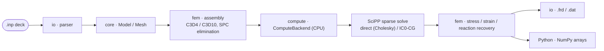
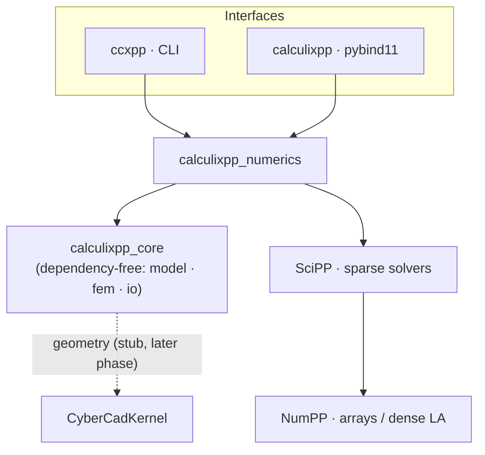
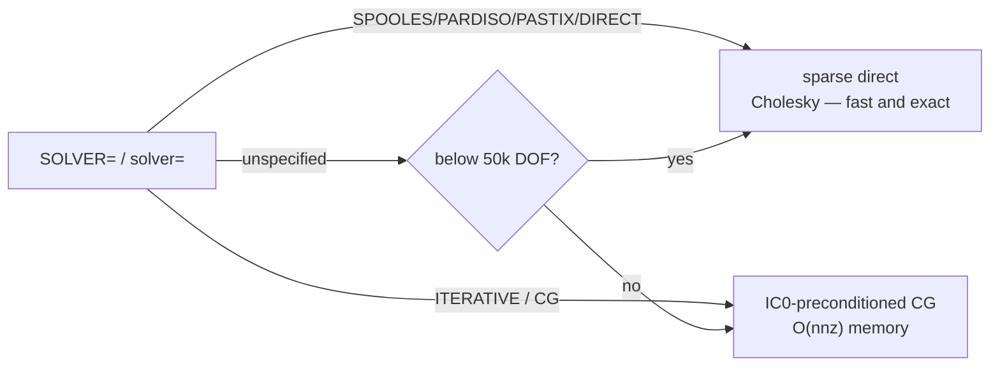
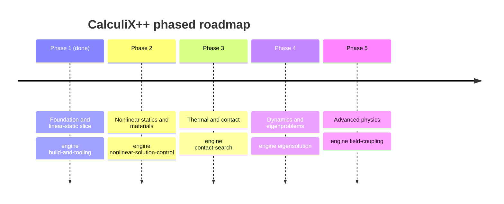

# CalculiX++ &nbsp;·&nbsp; `CalculixPP`

**A ground-up port of the [CalculiX](https://github.com/Dhondtguido/CalculiX) 3-D structural finite element solver to modern, portable C++20** — built to run on mobile (iOS/Android) and desktop, with optional GPU acceleration and first-class Python bindings.

  -3B5526) 

Numerics come from in-house libraries — **[NumPP](https://github.com/CyberdyneCorp/NumPP)** (NumPy-equivalent arrays + dense linear algebra) and **[SciPP](https://github.com/CyberdyneCorp/SciPP)** (SciPy-equivalent; sparse matrices and solvers) — with **[CyberCadKernel](https://github.com/CyberdyneCorp/CyberCadKernel)** for CAD/meshing. The whole design is spec-driven: the specification and phased roadmap live in [`openspec/`](openspec/).

> **Phase 1 (Foundation) is complete and validated.** The linear-static pipeline solves the reference `beam10p.inp` cantilever and its nodal displacements match **stock CalculiX to a relative L2 of 5.4 × 10⁻⁸**. A larger 8,268-DOF model solves in **0.34 s** (sparse Cholesky).

---

## Pipeline



## Features

| Area | Phase 1 (shipped) |
|---|---|
| **Elements** | Linear `C3D4` and quadratic `C3D10` tetrahedra, isotropic linear elasticity |
| **Input** | Abaqus-style `.inp`: `*NODE`, `*ELEMENT`, `*NSET`/`*ELSET`, `*SURFACE`, `*MATERIAL`/`*ELASTIC`/`*DENSITY`, `*SOLID SECTION`, `*BOUNDARY`, `*CLOAD`, `*DLOAD` (pressure), `*STEP`/`*STATIC` (`SOLVER=`) |
| **Solve** | Sparse `K u = f` via SciPP — **sparse direct (Cholesky)** or **IC0-preconditioned CG**, auto-selected by problem size; single-point-constraint elimination |
| **Results** | Nodal displacement, stress, strain, reaction forces; **CGX-compatible `.frd`** (DISP/STRESS/STRAIN/FORC) + tabular `.dat` |
| **Interfaces** | `ccxpp` command-line runner and a **`calculixpp` Python module** (NumPy arrays) |
| **Compute** | Pluggable `ComputeBackend` (CPU reference today); **builds & runs with no GPU toolkit** — GPU backends are additive |
| **Portability** | Pure C++20, mobile-first; iOS/Android cross-compile toolchain files |
| **Quality** | Validated against stock CalculiX references; CI runs build + tests + `openspec validate` |

## Architecture



`calculixpp_core` has **no external dependencies** — the domain model, element kernels, and assembly build and test everywhere (including mobile toolchains). Only the thin numerics layer links SciPP/NumPP.

## Build

```bash
# Core + solver + CLI + Python module
cmake -S . -B build -G Ninja \
  -DCALCULIXPP_WITH_SOLVER=ON -DCALCULIXPP_BUILD_PYTHON=ON
cmake --build build
ctest --test-dir build --output-on-failure
```

Requires a C++20 compiler and CMake ≥ 3.24. The numerics layer needs **NumPP** and **SciPP** (≥ v1.2.0); `scripts/bootstrap_deps.sh` builds/installs NumPP and points the build at a SciPP checkout. Python bindings additionally need `pip install pybind11 pytest numpy`. **No GPU toolkit is required.**

## Quick start

### Command line

```bash
build/apps/ccxpp beam10p.inp -o beam10p          # writes beam10p.frd, beam10p.dat
# CalculiX++  beam10p.inp
#   nodes=90  elements=31
#   max |u|        = 0.0881733
#   max von Mises  = 404.262

build/apps/ccxpp beam10p.inp --solver cg          # force IC0-CG (default is size-based)
```

### Python

```python
import calculixpp
import numpy as np

r = calculixpp.solve("beam10p.inp")               # solver="" -> auto; or "direct" / "cg"
U = r["displacement"]                             # (N, 3) NumPy array
S = r["stress"]                                   # (N, 6): xx,yy,zz,xy,xz,yz

print("nodes:", r["num_nodes"], "elements:", r["num_elements"])
print("max |u| =", np.linalg.norm(U, axis=1).max())

# von Mises from the stress tensor
sxx, syy, szz, sxy, sxz, syz = (S[:, i] for i in range(6))
vm = np.sqrt(0.5 * ((sxx - syy) ** 2 + (syy - szz) ** 2 + (szz - sxx) ** 2)
             + 3 * (sxy ** 2 + sxz ** 2 + syz ** 2))
print("max von Mises =", vm.max())

# Inspect a deck without solving, and query compute backends
calculixpp.summary("beam10p.inp")                 # {num_nodes, num_elements, materials, ...}
calculixpp.available_backends()                   # ['cpu']  (GPU backends land later)
```

### C++

```cpp
#include "calculixpp/io/inp_parser.hpp"
#include "calculixpp/io/results_writer.hpp"
#include "calculixpp/numerics/linear_static.hpp"

int main() {
  using namespace cxpp;
  const Model model = io::parse_inp_file("beam10p.inp");

  // solver auto-selected from the model (SOLVER= / size); pass a SolverKind to force it
  const StaticFields f = numerics::solve_linear_static(model);

  io::write_frd("beam10p.frd", model, f);   // U, S, E, RF (CGX-compatible)
  io::write_dat("beam10p.dat", model, f);
}
```

```cmake
find_package(NumPP CONFIG REQUIRED)         # + add_subdirectory(SciPP) — see bootstrap
target_link_libraries(my_app PRIVATE calculixpp::numerics)
```

## Solver selection

The `SOLVER=` keyword (or the `--solver` / `solver=` argument) chooses the path; when unspecified, **Auto** picks by problem size:



Direct is fastest and exact for small/medium systems; IC0-CG keeps memory linear for large 3-D meshes (important on mobile). Both agree to < 10⁻⁵ on an 8k-DOF cross-check.

## Validation & performance

- **Accuracy** — `beam10p.inp` (90 nodes, 31 C3D10) nodal displacements vs stock CalculiX `beam10p.dat.ref`: **relative L2 = 5.4 × 10⁻⁸**.
- **Scaling** — `segmentunsmooth` (8,268 DOF): sparse direct **0.34 s**; IC0-CG **1.30 s** — both to the same solution. (The earlier dense path took 94 s; see [SciPP #10](https://github.com/CyberdyneCorp/SciPP/issues/10).)
- **Correctness harness** — analytical element patch tests (gradient consistency, uniaxial stress/strain), pressure-load equilibrium, and reference-deck regression, all in CI.

## Roadmap

Each phase implements physics from the baseline specs **and** adds one reusable *engine* capability. Phase 1 is done; the rest are fully specified and queued.



| Phase | Scope | Status |
|---|---|---|
| **1 — Foundation** | Build system, NumPP/SciPP, CPU backend, linear-static slice, Python bindings | ✅ complete |
| **2 — Nonlinear** | Newton-Raphson, plasticity, hyperelastic/creep, element & load breadth, constraints | 📋 specified |
| **3 — Thermal & contact** | Heat transfer, coupled thermomechanics, contact | 📋 specified |
| **4 — Dynamics** | Frequency, buckling, direct/modal dynamics, substructures | 📋 specified |
| **5 — Advanced** | CFD/networks, electromagnetics, crack propagation, optimization | 📋 specified |

## Spec-driven development

CalculiX++ is developed with [OpenSpec](https://openspec.dev). [`openspec/specs/`](openspec/specs/) holds 26 capability specs describing target behavior (grounded in the reference CalculiX and its keyword set); [`openspec/changes/`](openspec/changes/) holds the phased change proposals. CI gates on `openspec validate --all --strict`.

```bash
openspec list                 # active change proposals
openspec list --specs         # capability specs
openspec validate --all --strict
```

## Dependencies

| Library | Role | Required |
|---|---|---|
| [NumPP](https://github.com/CyberdyneCorp/NumPP) | N-D arrays, dense linear algebra, compute-backend runtime | yes (solver) |
| [SciPP](https://github.com/CyberdyneCorp/SciPP) ≥ v1.2.0 | Sparse matrices, sparse direct + preconditioned iterative solvers | yes (solver) |
| [pybind11](https://github.com/pybind/pybind11) | Python bindings | Python only |
| [CyberCadKernel](https://github.com/CyberdyneCorp/CyberCadKernel) | CAD import & meshing | later phases |
| CUDA / OpenCL / Metal | Optional GPU acceleration | never required |

## License

See [LICENSE](LICENSE). CalculiX++ is an independent C++20 reimplementation; CalculiX itself (Prof. G. Dhondt / Prof. K. Wittig) is the behavioral reference.
