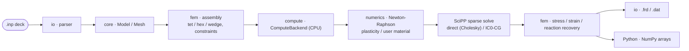
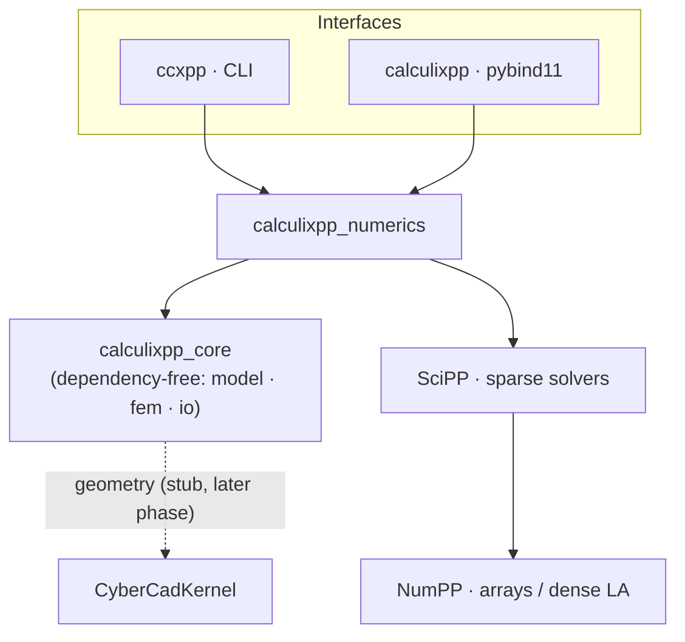
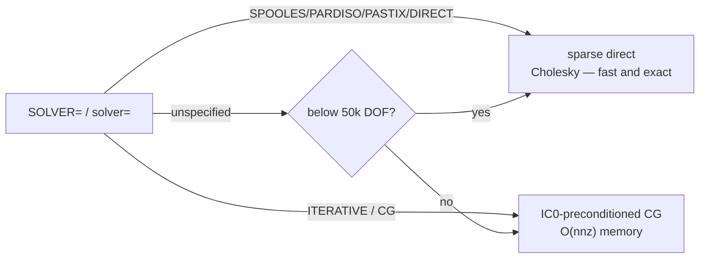
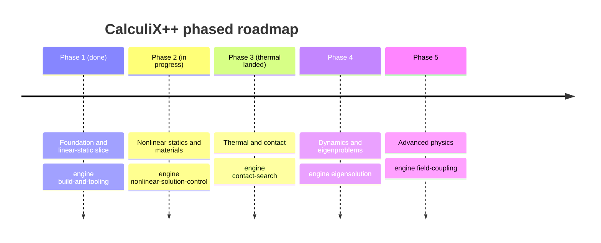

# CalculiX++ &nbsp;·&nbsp; `CalculixPP`

**A ground-up port of the [CalculiX](https://github.com/Dhondtguido/CalculiX) 3-D structural finite element solver to modern, portable C++20** — built to run on mobile (iOS/Android) and desktop, with optional GPU acceleration and first-class Python bindings.

  -3B5526) 

Numerics come from in-house libraries — **[NumPP](https://github.com/CyberdyneCorp/NumPP)** (NumPy-equivalent arrays + dense linear algebra) and **[SciPP](https://github.com/CyberdyneCorp/SciPP)** (SciPy-equivalent; sparse matrices and solvers) — with **[CyberCadKernel](https://github.com/CyberdyneCorp/CyberCadKernel)** for CAD/meshing. The whole design is spec-driven: the specification and phased roadmap live in [`openspec/`](openspec/).

> **Phase 1 (Foundation) is complete and validated.** The linear-static pipeline solves the reference `beam10p.inp` cantilever and its nodal displacements match **stock CalculiX to a relative L2 of 5.4 × 10⁻⁸**. A larger 8,268-DOF model solves in **0.34 s** (sparse Cholesky).
>
> **Phase 2 (Nonlinear statics & materials) is in progress.** A Newton-Raphson driver (`solve_nonlinear`) with automatic incrementation now drives J2 plasticity, a C++ user-material seam, and the full hex/wedge element family (`C3D8`/`C3D20`/`C3D6`/`C3D15` + reduced `C3D8R`/`C3D20R`), plus amplitudes, body loads (`GRAV`/`CENTRIF`), springs/masses, and constraints (`*EQUATION`/`*MPC`/`*RIGID BODY`/`*COUPLING`/`*TIE`). New reference decks validate: `beam8p` (C3D8) and `beam20p` (C3D20) match stock CalculiX to **rel-L2 ~5.7 × 10⁻⁸**, and the nonlinear driver reproduces the linear solve to **< 10⁻¹⁰** in one increment.
>
> **Phase 3 (Thermal & contact) — the THERMAL track is landed and validated.** A scalar 1-DOF/node temperature field runs in parallel to the mechanical path, reusing the same mesh, shape functions/Gauss rules, and sparse solve: steady-state and transient (backward-Euler) conduction, `*CFLUX`/`*DFLUX` heat loads, convective `*FILM`, linearized surface `*RADIATE`, and one-way `*COUPLED TEMPERATURE-DISPLACEMENT` thermal stress (`*EXPANSION`), plus element/contact-pair `*MODEL CHANGE`. `solve()` auto-dispatches a `*HEAT TRANSFER` deck and returns nodal temperature (`NT`) and heat-flux reaction (`RFL`). Validated against stock CalculiX heat decks (`oneel20cf`/`df`/`fi` steady conduction to ~1e-9, `oneel20fi2` transient film relaxation to ~1e-4) and the `beamt` thermal-stress deck (rel-L2 ~2.4 × 10⁻⁶). **Contact (search engine, contact pairs, friction, thermal gap conductance) is the next workflow** — those cards are parsed but rejected with an actionable error rather than silently mis-solved.

---

## Pipeline



## Features

| Area | Phase 1 (shipped) | Phase 2 (in progress) |
|---|---|---|
| **Elements** | Linear `C3D4` and quadratic `C3D10` tetrahedra, isotropic linear elasticity | Hex/wedge families `C3D8` / `C3D20` / `C3D6` / `C3D15` (full) + reduced `C3D8R` (hourglass control) / `C3D20R`; discrete `*SPRING` / `*MASS` / `*DASHPOT` |
| **Materials** | Isotropic linear elasticity (`*ELASTIC`) | Rate-independent J2 plasticity (`*PLASTIC`, isotropic/kinematic/combined + `*CYCLIC HARDENING`) with consistent tangent; neo-Hookean `*HYPERELASTIC`; C++ `*USER MATERIAL` (`*DEPVAR`/`*RATEDEPENDENT`) |
| **Solve** | Linear `K u = f` (sparse direct / IC0-CG) | Newton-Raphson `solve_nonlinear` with automatic incrementation, cutback, `DIRECT`, `*CONTROLS`, and optional line search |
| **Loads** | `*CLOAD`, `*DLOAD` (pressure) | `*AMPLITUDE` (step/tabular/periodic), body loads `GRAV` / `CENTRIF`, `*DSLOAD`, `OP=MOD`/`OP=NEW` |
| **Constraints** | Single-point `*BOUNDARY` | `*EQUATION`, `*MPC` (BEAM/PLANE/STRAIGHT), `*RIGID BODY`, `*COUPLING` (kinematic/distributing), matching `*TIE`; over-constraint detection |
| **Input** | Abaqus-style `.inp`: `*NODE`, `*ELEMENT`, `*NSET`/`*ELSET`, `*SURFACE`, `*MATERIAL`/`*ELASTIC`/`*DENSITY`, `*SOLID SECTION`, `*BOUNDARY`, `*CLOAD`, `*DLOAD` (pressure), `*STEP`/`*STATIC` (`SOLVER=`) | Full Phase-2 card set above; deferred cards (`*HYPERFOAM`, `*CREEP`, `*VISCO`, `*MOHR COULOMB`, `*SHELL`/`*BEAM SECTION`, ...) raise a clear, actionable error rather than a silent wrong solve |
| **Results** | Nodal displacement, stress, strain, reaction forces; **CGX-compatible `.frd`** (DISP/STRESS/STRAIN/FORC) + tabular `.dat` | Nonlinear result payload: `converged`, `newton_increments` / `newton_iterations` / `newton_cutbacks`; solve-free `summary()` introspection of the Phase-2 capabilities |
| **Interfaces** | `ccxpp` command-line runner and a **`calculixpp` Python module** (NumPy arrays) | `solve_nonlinear` / `solve_nonlinear_text` bindings; `solve()` auto-routes plastic/nonlinear decks to the Newton driver |
| **Compute** | Pluggable `ComputeBackend` (CPU reference today); **builds & runs with no GPU toolkit** — GPU backends are additive | (unchanged — CPU reference backend) |
| **Portability** | Pure C++20, mobile-first; iOS/Android cross-compile toolchain files | (unchanged) |
| **Quality** | Validated against stock CalculiX references; CI runs build + tests + `openspec validate` | New reference decks `beam8p` / `beam20p` and `achtel*` (`*EQUATION` / body loads) validated; plasticity/user-material against analytic solutions |

## Architecture



`calculixpp_core` has **no external dependencies** — the domain model, element kernels, and assembly build and test everywhere (including mobile toolchains). Only the thin numerics layer links SciPP/NumPP.

## Build

```bash
# Core + solver + CLI + Python module
cmake -S . -B build -G Ninja \
  -DCALCULIXPP_WITH_SOLVER=ON -DCALCULIXPP_BUILD_PYTHON=ON
cmake --build build
ctest --test-dir build --output-on-failure
```

Requires a C++20 compiler and CMake ≥ 3.24. The numerics layer needs **NumPP** and **SciPP** (≥ v1.2.0); `scripts/bootstrap_deps.sh` builds/installs NumPP and points the build at a SciPP checkout. Python bindings additionally need `pip install pybind11 pytest numpy`. **No GPU toolkit is required.**

## Quick start

### Command line

```bash
build/apps/ccxpp beam10p.inp -o beam10p          # writes beam10p.frd, beam10p.dat
# CalculiX++  beam10p.inp
#   nodes=90  elements=31
#   max |u|        = 0.0881733
#   max von Mises  = 404.262

build/apps/ccxpp beam10p.inp --solver cg          # force IC0-CG (default is size-based)
```

### Python

```python
import calculixpp
import numpy as np

r = calculixpp.solve("beam10p.inp")               # solver="" -> auto; or "direct" / "cg"
U = r["displacement"]                             # (N, 3) NumPy array
S = r["stress"]                                   # (N, 6): xx,yy,zz,xy,xz,yz

print("nodes:", r["num_nodes"], "elements:", r["num_elements"])
print("max |u| =", np.linalg.norm(U, axis=1).max())

# von Mises from the stress tensor
sxx, syy, szz, sxy, sxz, syz = (S[:, i] for i in range(6))
vm = np.sqrt(0.5 * ((sxx - syy) ** 2 + (syy - szz) ** 2 + (szz - sxx) ** 2)
             + 3 * (sxy ** 2 + sxz ** 2 + syz ** 2))
print("max von Mises =", vm.max())

# Inspect a deck without solving, and query compute backends
calculixpp.summary("beam10p.inp")                 # {num_nodes, num_elements, materials, ...}
calculixpp.available_backends()                   # ['cpu']  (GPU backends land later)
```

### Python — nonlinear (Phase 2)

A deck with `*PLASTIC` (or any nonlinear material) is auto-routed through the Newton-Raphson driver by `solve()`; you can also call `solve_nonlinear` explicitly to pass driver options and read back the increment/iteration report. This example takes a single `C3D8` hex past yield and recovers the analytic uniaxial hardening curve `sigma = sy0 + H * eps_p`:

```python
import calculixpp

plastic_cube = """
*NODE
1, 0., 0., 0.
2, 1., 0., 0.
3, 1., 1., 0.
4, 0., 1., 0.
5, 0., 0., 1.
6, 1., 0., 1.
7, 1., 1., 1.
8, 0., 1., 1.
*ELEMENT, TYPE=C3D8, ELSET=EALL
1, 1, 2, 3, 4, 5, 6, 7, 8
*BOUNDARY
1, 1, 1
4, 1, 1
5, 1, 1
8, 1, 1
1, 2, 2
2, 2, 2
5, 2, 2
6, 2, 2
1, 3, 3
2, 3, 3
3, 3, 3
4, 3, 3
*MATERIAL, NAME=STEEL
*ELASTIC
210000., 0.3
*PLASTIC
800., 0.0
960., 0.02
*SOLID SECTION, ELSET=EALL, MATERIAL=STEEL
*STEP
*STATIC
0.25, 1.0
*CLOAD
5, 3, 225.
6, 3, 225.
7, 3, 225.
8, 3, 225.
*END STEP
"""

# Explicit Newton driver (optional line_search=True for hard increments).
r = calculixpp.solve_nonlinear_text(plastic_cube)
print("converged:", r["converged"], "increments:", r["newton_increments"])

S = r["stress"]                                    # (N, 6): xx,yy,zz,xy,xz,yz
szz = sum(float(S[k][2]) for k in range(len(S))) / len(S)
print("axial stress =", szz)                       # -> 900.0  (sy0=800 + 8000 * 0.0125)

# solve() auto-dispatches the same plastic deck to the nonlinear driver.
same = calculixpp.solve_text(plastic_cube)
assert same["converged"] is True

# summary() introspects Phase-2 capabilities without solving.
s = calculixpp.summary_text(plastic_cube)
print(s["element_type_counts"], "plastic:", s["has_plasticity"])
```

### Python — heat transfer (Phase 3)

A `*HEAT TRANSFER` deck is auto-dispatched by `solve()` to the scalar thermal solver, which returns the nodal temperature field (`NT`) and the heat-flux reaction (`RFL`) instead of displacement/stress. This unit cube conducts between a hot face (x=1, held at 100) and a cold face (x=0, held at 0); the analytic steady field is a linear profile, recovered exactly:

```python
import calculixpp

heat_cube = """
*NODE
1, 0., 0., 0.
2, 1., 0., 0.
3, 1., 1., 0.
4, 0., 1., 0.
5, 0., 0., 1.
6, 1., 0., 1.
7, 1., 1., 1.
8, 0., 1., 1.
*ELEMENT, TYPE=C3D8, ELSET=EALL
1, 1, 2, 3, 4, 5, 6, 7, 8
*MATERIAL, NAME=COND
*CONDUCTIVITY
50.
*SOLID SECTION, ELSET=EALL, MATERIAL=COND
*STEP
*HEAT TRANSFER, STEADY STATE
*BOUNDARY
1, 11, 11, 0.
4, 11, 11, 0.
5, 11, 11, 0.
8, 11, 11, 0.
2, 11, 11, 100.
3, 11, 11, 100.
6, 11, 11, 100.
7, 11, 11, 100.
*END STEP
"""

r = calculixpp.solve_text(heat_cube)
print(r["procedure"])                              # -> "heat transfer steady state"
T = r["temperature"]                               # (N,) nodal temperature (NT)
Q = r["flux_reaction"]                             # (N,) heat-flux reaction (RFL)
print("T range:", float(min(T)), "->", float(max(T)))   # 0.0 -> 100.0 (linear profile)

# summary() reports the analysis procedure without solving.
print(calculixpp.summary_text(heat_cube)["procedure"])  # "heat transfer steady state"
```

Transient conduction (drop `STEADY STATE`, add `*SPECIFIC HEAT` / `*DENSITY` and an `*INITIAL CONDITIONS, TYPE=TEMPERATURE`) marches backward-Euler over the step period; `*COUPLED TEMPERATURE-DISPLACEMENT` returns both the temperature and the thermal-stress mechanical fields in one result dict.

### C++

```cpp
#include "calculixpp/io/inp_parser.hpp"
#include "calculixpp/io/results_writer.hpp"
#include "calculixpp/numerics/linear_static.hpp"

int main() {
  using namespace cxpp;
  const Model model = io::parse_inp_file("beam10p.inp");

  // solver auto-selected from the model (SOLVER= / size); pass a SolverKind to force it
  const StaticFields f = numerics::solve_linear_static(model);

  io::write_frd("beam10p.frd", model, f);   // U, S, E, RF (CGX-compatible)
  io::write_dat("beam10p.dat", model, f);
}
```

```cmake
find_package(NumPP CONFIG REQUIRED)         # + add_subdirectory(SciPP) — see bootstrap
target_link_libraries(my_app PRIVATE calculixpp::numerics)
```

## Solver selection

The `SOLVER=` keyword (or the `--solver` / `solver=` argument) chooses the path; when unspecified, **Auto** picks by problem size:



Direct is fastest and exact for small/medium systems; IC0-CG keeps memory linear for large 3-D meshes (important on mobile). Both agree to < 10⁻⁵ on an 8k-DOF cross-check.

## Validation & performance

- **Accuracy (Phase 1)** — `beam10p.inp` (90 nodes, 31 C3D10) nodal displacements vs stock CalculiX `beam10p.dat.ref`: **relative L2 = 5.36 × 10⁻⁸**.
- **Accuracy (Phase 2)** — the hex family matches stock CalculiX references: `beam8p` (C3D8) **rel-L2 = 5.71 × 10⁻⁸**, `beam20p` (C3D20) **rel-L2 = 5.76 × 10⁻⁸**; `achtel*` decks validate `*EQUATION` constraints and `GRAV`/`CENTRIF` body loads to rel-L2 ~1–2 × 10⁻⁷.
- **Nonlinear gate** — the Newton-Raphson driver reproduces the linear direct solve to **rel-L2 < 10⁻¹⁰** in one increment (single-tet and beam10p), so nonlinear does not perturb linear results. J2 plasticity and the C++ user material are validated against their analytic solutions.
- **Accuracy (Phase 3 — thermal)** — heat-transfer nodal temperatures (`NT`) vs stock CalculiX: steady conduction `oneel20cf`/`df`/`fi` (`*CFLUX`/`*DFLUX`/`*FILM`) to **max abs ~10⁻⁹**, transient film `oneel20fi2` relaxing to the end-of-step steady field to **~10⁻⁴** (reference uses adaptive sub-stepping, we march fixed sub-steps). One-way thermal stress `beamt` (C3D20R `*EXPANSION` + `*TEMPERATURE`) to **rel-L2 ~2.4 × 10⁻⁶**. The pure-mechanical path is byte-for-byte unchanged (a deck with no applied temperature never touches the thermal gates).
- **Scaling** — `segmentunsmooth` (8,268 DOF): sparse direct **0.34 s**; IC0-CG **1.30 s** — both to the same solution. (The earlier dense path took 94 s; see [SciPP #10](https://github.com/CyberdyneCorp/SciPP/issues/10).)
- **Correctness harness** — analytical element patch tests (gradient consistency, uniaxial stress/strain, hex/wedge partition-of-unity + rigid-body null space), pressure-load equilibrium, consistent-tangent finite-difference checks, and reference-deck regression, all in CI.

## Roadmap

Each phase implements physics from the baseline specs **and** adds one reusable *engine* capability. Phase 1 is done and Phase 2 is in progress; the rest are fully specified and queued.



| Phase | Scope | Status |
|---|---|---|
| **1 — Foundation** | Build system, NumPP/SciPP, CPU backend, linear-static slice, Python bindings | ✅ complete |
| **2 — Nonlinear** | Newton-Raphson, plasticity, user material, hex/wedge & load breadth, constraints | 🚧 in progress |
| **3 — Thermal & contact** | Heat transfer, coupled thermomechanics, model change, contact | 🚧 thermal landed; contact next |
| **4 — Dynamics** | Frequency, buckling, direct/modal dynamics, substructures | 📋 specified |
| **5 — Advanced** | CFD/networks, electromagnetics, crack propagation, optimization | 📋 specified |

## Spec-driven development

CalculiX++ is developed with [OpenSpec](https://openspec.dev). [`openspec/specs/`](openspec/specs/) holds 26 capability specs describing target behavior (grounded in the reference CalculiX and its keyword set); [`openspec/changes/`](openspec/changes/) holds the phased change proposals. CI gates on `openspec validate --all --strict`.

```bash
openspec list                 # active change proposals
openspec list --specs         # capability specs
openspec validate --all --strict
```

## Dependencies

| Library | Role | Required |
|---|---|---|
| [NumPP](https://github.com/CyberdyneCorp/NumPP) | N-D arrays, dense linear algebra, compute-backend runtime | yes (solver) |
| [SciPP](https://github.com/CyberdyneCorp/SciPP) ≥ v1.2.0 | Sparse matrices, sparse direct + preconditioned iterative solvers | yes (solver) |
| [pybind11](https://github.com/pybind/pybind11) | Python bindings | Python only |
| [CyberCadKernel](https://github.com/CyberdyneCorp/CyberCadKernel) | CAD import & meshing | later phases |
| CUDA / OpenCL / Metal | Optional GPU acceleration | never required |

## License

See [LICENSE](LICENSE). CalculiX++ is an independent C++20 reimplementation; CalculiX itself (Prof. G. Dhondt / Prof. K. Wittig) is the behavioral reference.
