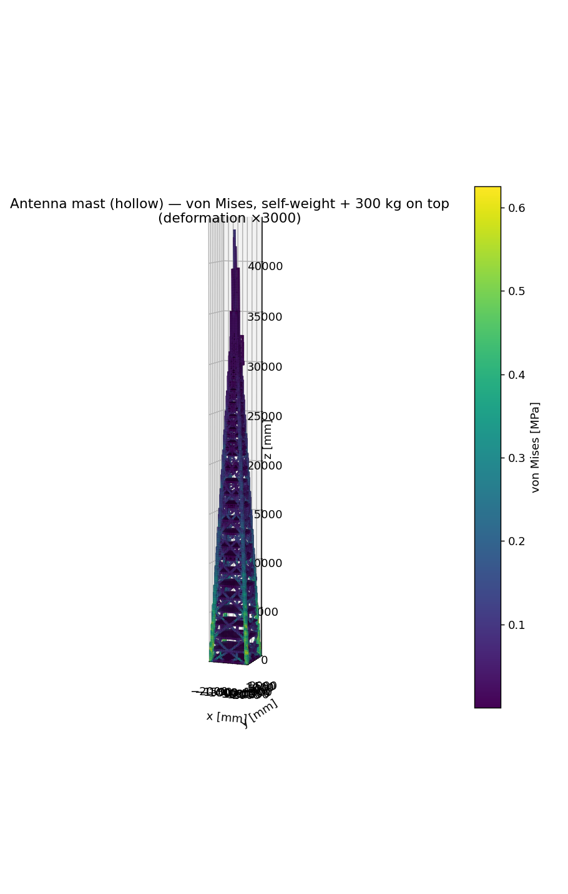
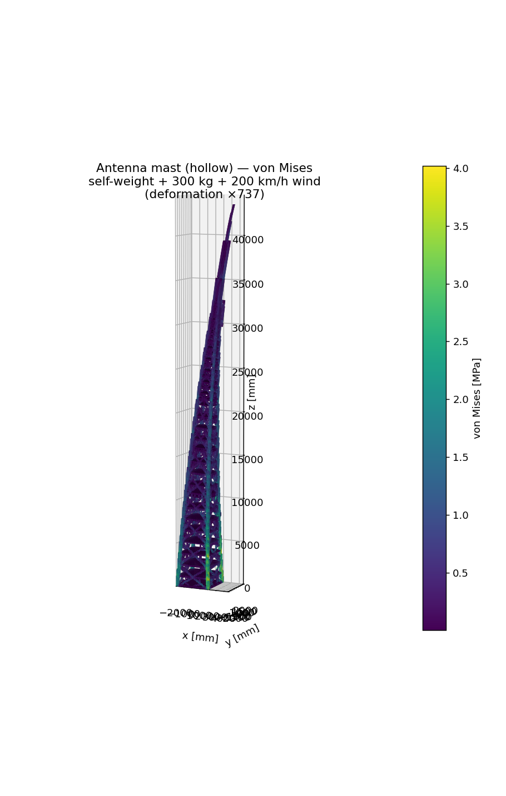

# Antenna mast stress — hollow tube, self-weight + 300 kg on top

Linear-static stress analysis of a cell-tower antenna mast (the red/white-banded
tapered `Antenna.obj`) as a **hollow tube** carrying its **own weight** plus a 300 kg
antenna payload on top, with CalculiX++ — with and without a **200 km/h side wind**.

| Self-weight + 300 kg (`antenna_von_mises.png`) | + 200 km/h wind (`antenna_wind_von_mises.png`) |
|---|---|
|  |  |

## Pipeline

```
Antenna.obj --(surface raster + per-slice fill)--> solid --(hollow)--> C3D8 shell --(CalculiX++)--> stress
```

Uses the shared [`../femkit.py`](../femkit.py) toolkit.

1. **Read** `Antenna.obj`, reorient so the mast's long axis is Z (up).
2. **Solidify** (`voxelize_solid_fill`) — the OBJ is a thin-walled tube whose wall is far
   thinner than any practical voxel, so an inside test finds almost nothing. Instead
   rasterise the surface and fill each horizontal cross-section to get the solid the
   outer surface bounds.
3. **Hollow** (`hollow_shell`) — subtract an eroded core, leaving a one-voxel wall so the
   model is a tube, not a heavy slug (~55 000 hexes at 100 mm voxels, 44.5 m tall).
4. **Calibrate the mass.** The voxel wall (150 mm) is ~10× a real steel wall (~15 mm),
   which voxels can't reach — so don't trust the modelled volume for mass. Instead set
   the **density** so the model weighs what the real tube would: `outer_area × 15 mm ×
   steel_density ≈ 20 t`. (The OBJ is a closed double-walled surface, so the outer area
   is ≈ half its total area.)
5. **Load & solve.** Clamp the base ring; apply **gravity** (self-weight, ~200 kN) plus
   the **300 kg payload** on the top ring. A thin-walled shell is ill-conditioned for
   CG, so the sparse **direct** solver is forced (~2 min at 100 mm / 322k DOF).

Always preview the mesh first (`--preview` → `antenna_mesh.png`, a 4-view render).

### Resolution vs cost

`VOXEL_MM` is the sharpness knob, but the hollow shell has ~`1/voxel²` hexes and the
**direct** solve grows steeply (CG can't help — a thin wall is too ill-conditioned):

| `VOXEL_MM` | hexes | DOF | direct solve |
|---|---|---|---|
| 150 mm | 22 k | 135 k | ~18 s |
| **100 mm** (default) | **56 k** | **322 k** | **~2 min** |
| 80 mm | 92 k | 600 k | ~8 min |
| 50 mm | 238 k | **1.4 M** | impractical (~40 GB, single-threaded direct did not finish in 13 min) |

100 mm is the practical sweet spot for a sharp mesh. Going finer needs a parallel
(multifrontal) direct solver or a robust preconditioner — a current solver limitation.

## Run

```bash
export PYTHONPATH=/path/to/CalculixPP/build/python
python3 antenna_stress.py --preview   # render the mesh (quality check)
python3 antenna_stress.py             # self-weight + payload
python3 antenna_stress.py --wind      # + 200 km/h side wind (writes antenna_wind_*.png)
```

Needs `numpy`, `scipy`, `matplotlib`. Writes `antenna_von_mises.png` and
`antenna_stress.vtk` (ParaView). Import `calculixpp` before `numpy` (see `../femkit.py`).

Tune `VOXEL_MM` for detail vs cost (smaller = finer + slower; the direct solve grows
quickly). `WALL_REAL_MM` sets the calibrated mass.

## Result

```
mass (calibrated to a 15 mm-wall tube) : 20 335 kg
max vertical shortening : -0.036 mm
max von Mises stress    :  0.758 MPa
vertical reaction sum   : +202 430 N  (= 199 487 N self-weight + 2 943 N payload) ✓
```

With self-weight included, the stress is **highest at the base and decays up the mast**
— each level carries the weight of everything above it, so the clamped base (plus its
corner stress concentrations) is the hot spot, tapering to near-zero near the tip with a
small bump at the payload. Peak ~0.43 MPa is comfortably below steel's ~250 MPa yield.
The reaction summing to self-weight + payload is the built-in equilibrium check.

The deformation is a ~0.04 mm axial shortening; the render **caps** the exaggeration so
this near-rigid response isn't blown into a misleading bend.

## Wind case (`--wind`) — bending governs

A **200 km/h side wind** is applied as steady drag along +X: dynamic pressure
`q = ½ρV² ≈ 1.89 kPa`, times a cylinder drag coefficient `Cd ≈ 0.7`, distributed as a
horizontal line-load by the projected width at each height (widest at the base). Total
sideways force ≈ **119 kN** — comparable to the 200 kN self-weight, but acting on a long
lever arm, so it **bends** the mast instead of just compressing it.

```
total wind force  : 119 kN sideways (horizontal reaction balances it ✓)
max lateral sway  : 6.0 mm
max von Mises     : 4.54 MPa   (vs 0.76 MPa without wind — ~6x)
```

The stress now comes from **bending**: it peaks at the clamped base on the windward/
leeward faces (tension one side, compression the other) and falls off up the mast. This
is the design-driving case for a real mast — wind, not the vertical payload. Still well
under yield (~250 MPa) for this stocky voxel section; a real thin-walled tube would be
more flexible and more highly stressed.

*Simplifications:* uniform wind speed with height (real profiles grow with altitude and
codes add gust factors), steady drag only (no vortex-shedding / dynamic amplification),
and the calibrated thick-wall section is stiffer than a real tube.

## Caveats & extensions

- **Mass is calibrated, not measured.** Voxels can't resolve a 15 mm wall, so the model
  is a thick-walled tube with a reduced (smeared) density chosen to match a realistic
  hollow-mast mass. Change `WALL_REAL_MM` to represent a heavier/lighter mast.
- **Axial only.** Self-weight and a vertical payload load the mast axially. The design
  driver for a real mast is **lateral wind** (and eccentric antenna arrays), which bend
  it and raise base stresses far more — add a horizontal top `*CLOAD` to explore that.
- **Staircase mesh + solid elements.** No shell elements yet (deferred in CalculiX++),
  so the tube wall is one layer of solid hexes. A body-fitted shell mesh would be the
  faithful model of a thin wall.
