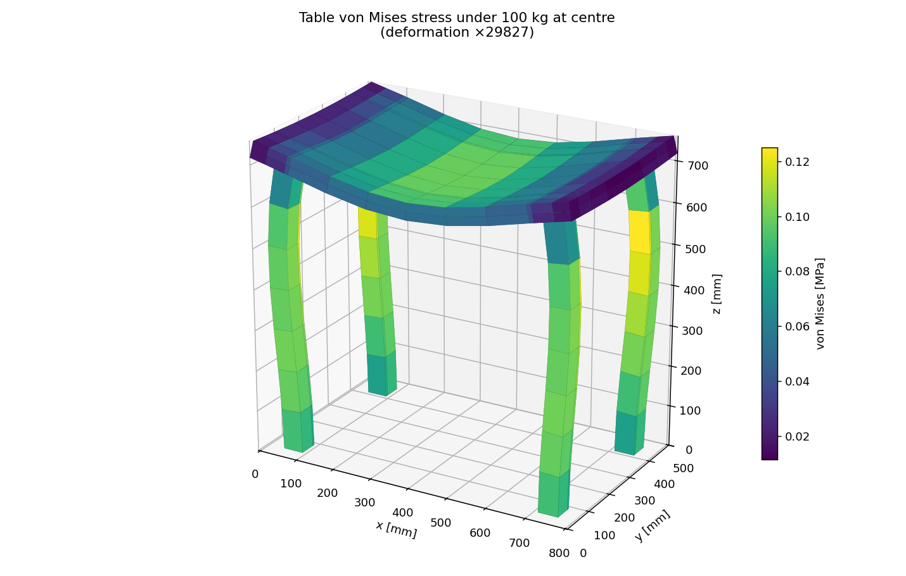
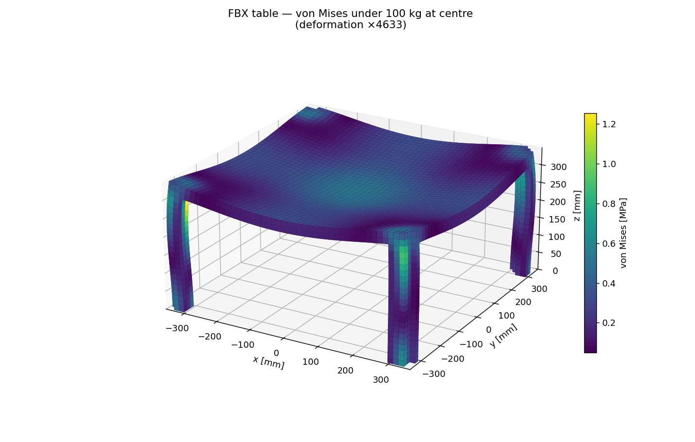

# Table stress analysis — 100 kg on the centre

CalculiX++ examples that put a 100 kg object at the centre of a table, solve the
linear-static step, and visualise the von Mises stress on the deformed body. Two
variants share the same solver + post-processing (the shared [`../femkit.py`](../femkit.py)):

- **`table_stress.py`** — builds a clean *parametric* table mesh in Python.
- **`fbx_table_stress.py`** — analyses the actual **`table.fbx`** art asset by
  voxelising it into a solid FE mesh.

| Parametric (`table_stress.py`) | From FBX (`fbx_table_stress.py`) |
|---|---|
|  |  |

## What it demonstrates

The full linear-static workflow through the **Python bindings**, with no `.inp` file on
disk — the mesh is generated in Python and solved from text:

1. **Model construction** — a conforming C3D8 hexahedral mesh of a tabletop + four legs
   (shared nodes at the leg/tabletop interface).
2. **Boundary conditions** — the four leg bottoms are fully clamped (`*BOUNDARY`).
3. **Loading** — a 100 kg object at the centre becomes a downward `*CLOAD` of 981 N,
   spread over the top nodes under the object's footprint.
4. **Solve** — linear elastic steel, `cx.solve_text(deck)`.
5. **Post-processing** — nodal von Mises stress from the returned stress tensor.
6. **Visualisation** — a matplotlib 3D render of the deformed surface coloured by
   stress, plus a `.vtk` for ParaView.

## Run

```bash
export PYTHONPATH=/path/to/CalculixPP/build/python
python3 table_stress.py                 # parametric mesh
python3 fbx_table_stress.py --preview   # FBX: just render the mesh (quality check)
python3 fbx_table_stress.py             # FBX: mesh + solve + stress
```

Requires `numpy` and `matplotlib`; the FBX variant also needs `scipy`. Each script
writes a `*_von_mises.png` render and a `*_stress.vtk` (open in ParaView: colour by
`von_mises`, warp by `displacement`). `--preview` writes `fbx_table_mesh.png`, a
4-view render of the *undeformed* mesh — always eyeball this before trusting a result.

> **Import order matters.** The script imports `calculixpp` **before** `numpy`. The
> compiled module links the system `libstdc++`; importing `numpy` first can load an
> older `libstdc++` (e.g. from a conda environment) and shadow the symbols the module
> needs. Keep `import calculixpp` at the top.

## Units

Standard CalculiX consistent set — **N, mm, MPa, tonne**:

| Quantity | Value | Note |
|---|---|---|
| Young's modulus `E` | 210000 MPa | structural steel |
| Poisson `ν` | 0.3 | |
| Density | 7.85e-9 tonne/mm³ | (only used if you add self-weight) |
| Gravity | 9810 mm/s² | |
| Object mass | 0.1 tonne | = 100 kg → 981 N weight |

## Expected output

```
max vertical deflection : -0.0027 mm
max von Mises stress    : 0.13 MPa  (steel yield ~250 MPa -> safety factor ~1950)
vertical reaction sum   : +981.0 N  (balances the 981 N weight)
```

A steel table barely notices 100 kg — the deflection is a few microns, so the render
exaggerates it (the scale factor is printed in the plot title). The **reaction sum
equal to the applied weight** is the built-in sanity check that equilibrium holds.

## Analysing the FBX asset (`fbx_table_stress.py`)

An FBX is a **surface** mesh (a triangle skin); FEA needs a **solid** (volume) mesh.
The bridge is **voxelisation**:

```
table.fbx --(Blender)--> table_solid.stl --(voxelise)--> C3D8 hex mesh --(CalculiX++)--> stress
```

1. **Surface extraction** — `table.fbx` holds several objects (the watertight table
   body, a thin tabletop overlay, decorative/floor planes). `extract_surface.py`, run
   under Blender, keeps the one watertight body and writes `table_solid.stl`.
   *This is a one-off; the resulting `table_solid.stl` is committed, so you only need
   Blender to regenerate it from a different FBX:*
   ```bash
   blender --background --python extract_surface.py
   ```
2. **Voxelisation** (`voxelize()`) — sample a 3-D grid over the model and keep the cells
   whose centres fall inside the shell, emitting one C3D8 hexahedron per inside cell. No
   external mesher is needed (~5100 hexes at 15 mm voxels).

   The inside test is the **generalized winding number** (sum of each triangle's signed
   solid angle at the point), *not* simple ray casting. This matters: a game-art asset
   like this table is built from several **overlapping closed shells** (tabletop + apron
   + legs), not one clean boolean solid. A single ray's crossing-parity mis-fires inside
   the overlaps and fills **phantom regions** — an early ray-cast version grew a spurious
   solid mass under the table centre (visible only from underneath) that quietly propped
   the tabletop up and, under load, showed as a floating plane in the deformed plot. The
   winding number evaluates the true union and is robust to overlaps and small leaks.
3. **Largest component** (`largest_component()`) — keep the largest 6-connected
   (face-adjacent) component as a safety net against stray voxel specks, so the FE
   domain is a single connected solid (no detached pieces → no rigid-body mechanisms).
4. **Analysis** — same clamps / 100 kg central load / solve / von Mises as the
   parametric case.

**Always preview the mesh first** (`--preview`) and check it from several angles — the
phantom-mass bug above was invisible from the default viewpoint and only obvious from
below. The committed result shows a clean 4-leg table, stress concentrating at the leg
tops (bending), deflection ~0.015 mm.

The voxel mesh is a *staircase* approximation of the real geometry (good enough to
demonstrate analysis straight from an art asset); a body-fitted tetrahedral mesh would
resolve the leg fillets and give sharper stresses. Tune fidelity with `VOXEL_MM` — keep
at least ~2 voxels through the thinnest feature (the tabletop) so it doesn't fragment
into edge/corner-only connections (hinges).

## Extending it

- **Self-weight**: add a gravity body load — append `*DLOAD` / `EALL,GRAV,9810,0,0,-1`
  before `*END STEP` (the density is already in the deck).
- **Heavier / off-centre load**: change `OBJECT_MASS` or the footprint filter in
  `TableMesh.top_center_ids()`.
- **Finer mesh**: raise the `np.linspace(...)` counts and leg z-layers in
  `TableMesh._build()` (the solve stays well under a second at this size).
- **Thinner tabletop / longer legs**: edit the geometry constants at the top — a
  thinner top or slimmer legs will show meaningfully higher stress.
